::: {.fun-page}
::: {.fun-intro}
Below are some non-academic things I am interested in or have been thinking about recently.
:::

::: {.fun-section}
::: {.fun-section-heading}
## Crochet

I learned to crochet when I was very young, but didn't get really into it until around 2022. I've been really enjoying blanket patterns by [Helen Shrimpton](https://crystalsandcrochet.com/product-category/patterns/blankets-afghan/) because of their interesting shapes and variety of stitches.
:::

::: {.fun-gallery .fun-gallery-featured .fun-gallery-crafts}
::: {.fun-photo .fun-photo-pair}
::: {.fun-photo-pair-images}
::: {.fun-photo-pair-image}
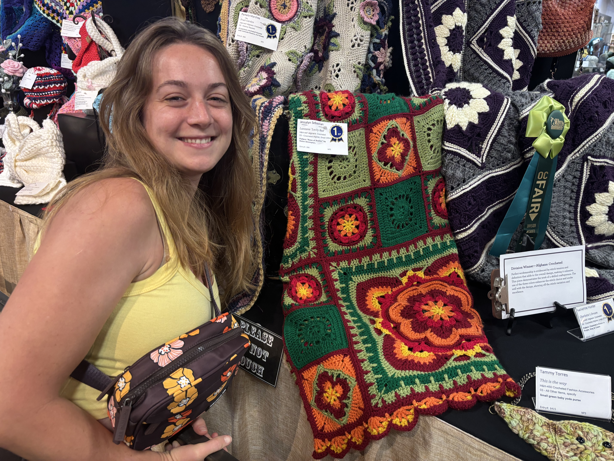{fig-alt="At the Orange County Fair with the blanket" loading="lazy"}
:::

::: {.fun-photo-pair-image}
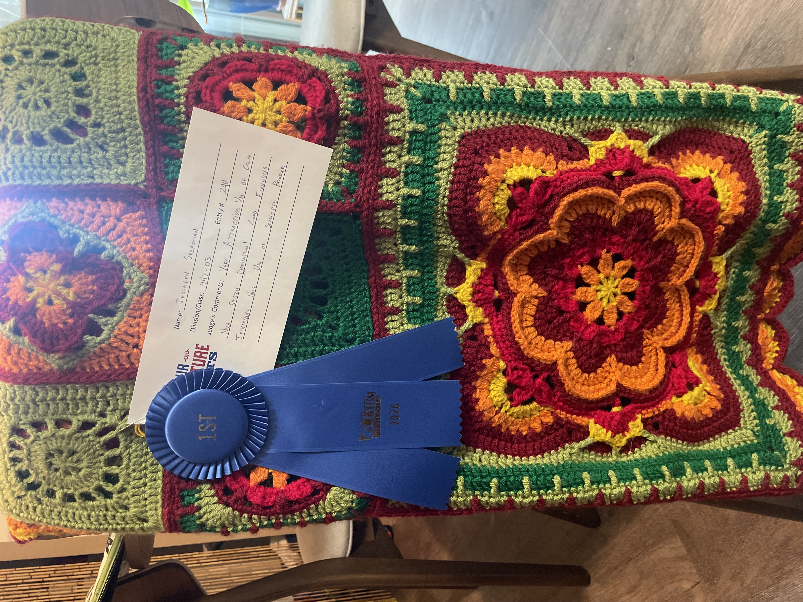{fig-alt="The blanket with its ribbon and judges' comments" loading="lazy"}
:::
:::

::: {.fun-photo-caption}
**At the Orange County Fair**

My lantana-inspired blanket won first place in its category in 2026!
:::
:::

::: {.fun-photo}
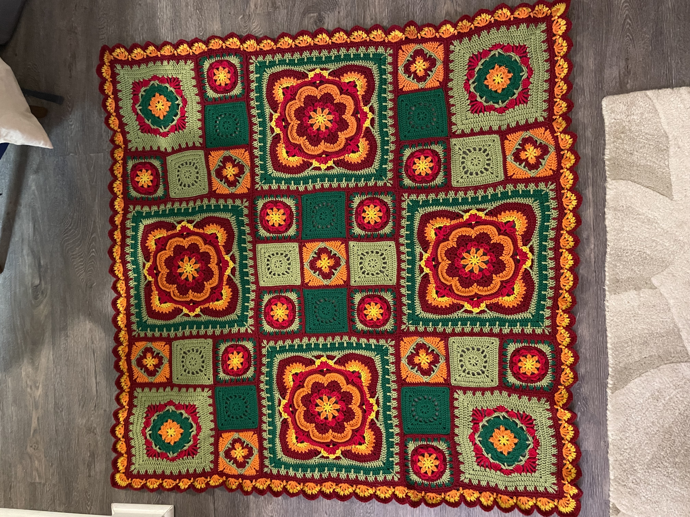{loading="lazy"}

::: {.fun-photo-caption}
**Rose of Avalon in lantana colors**

A full view of the finished blanket
:::
:::

::: {.fun-photo}
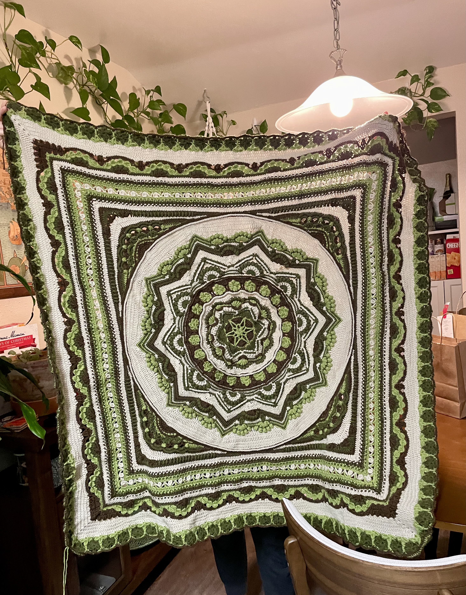{loading="lazy"}

::: {.fun-photo-caption}
**The Lost Garden in green and brown**

A gift for my parents that matches their decor
:::
:::

::: {.fun-photo}
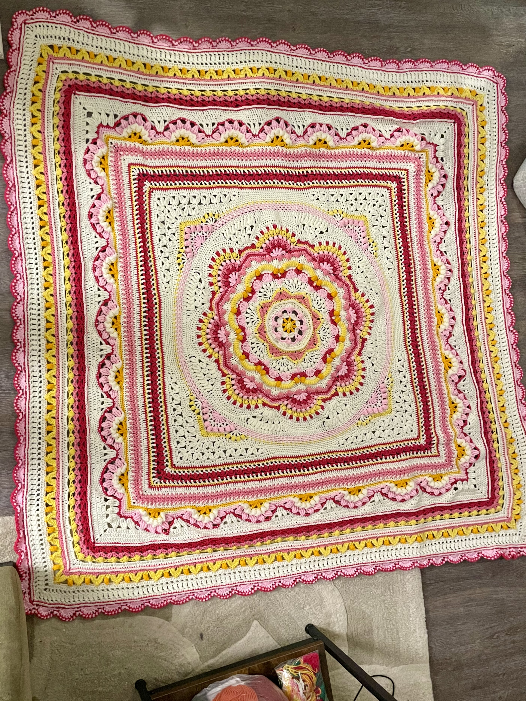{loading="lazy"}

::: {.fun-photo-caption}
**Arcadia in pink and yellow**

A gift for my close friend who couldn't choose between pink and yellow so I said, why not both?!
:::
:::

::: {.fun-photo}
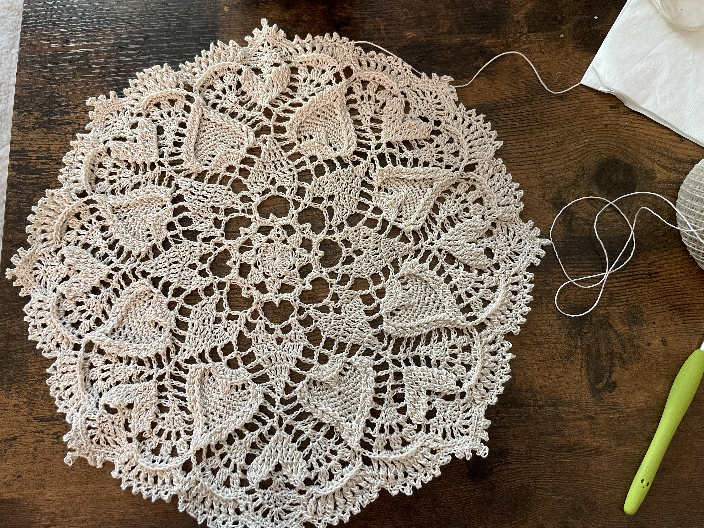{loading="lazy"}

::: {.fun-photo-caption}
**Hearts doily**

My first attempt at using crochet thread
:::
:::

:::
:::
:::

::: {.fun-section}
::: {.fun-section-heading}
## Reading

My favorite genres tend to be science fiction and urban fantasy, but I can be convinced to read pretty much anything. Here are some things I've read and enjoyed recently:

:::

::: {.fun-gallery .fun-gallery-books}
::: {.fun-photo}
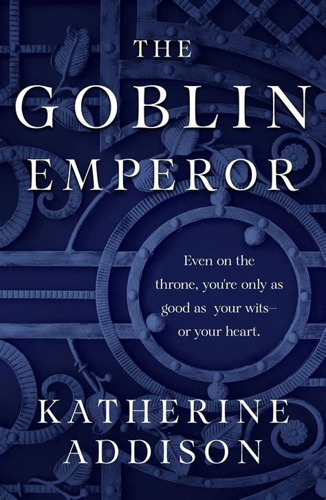{loading="lazy"}

::: {.fun-photo-caption}
**The Goblin Emperor**

This might be my all-time favorite book. How a book can be so feel-good while containing such dark themes is beyond me.
:::
:::

::: {.fun-photo}
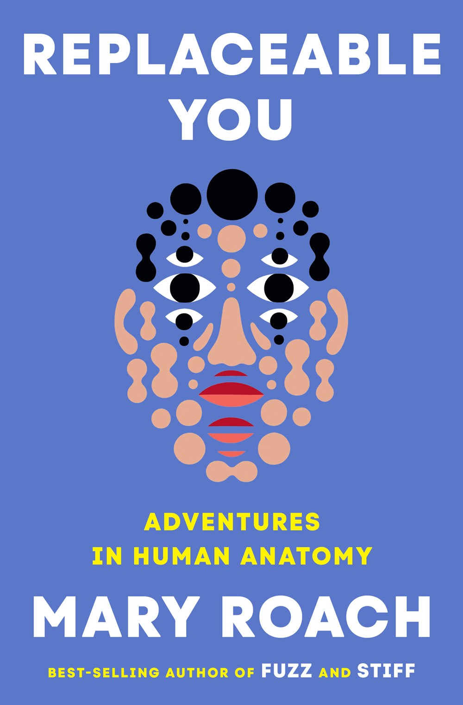{loading="lazy"}

::: {.fun-photo-caption}
**Replaceable You: Adventures in Human Anatomy**

An incredibly fun read as someone who is fascinated by human anatomy, and Mary Roach makes it wonderfully funny as well.
:::
:::

::: {.fun-photo}
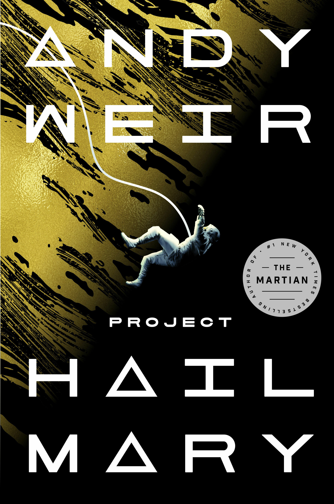{loading="lazy"}

::: {.fun-photo-caption}
**Project Hail Mary**

It is so much better than the movie. Please read the book instead of watching the movie. My favorite book I read in 2026.
:::
:::

::: {.fun-photo}
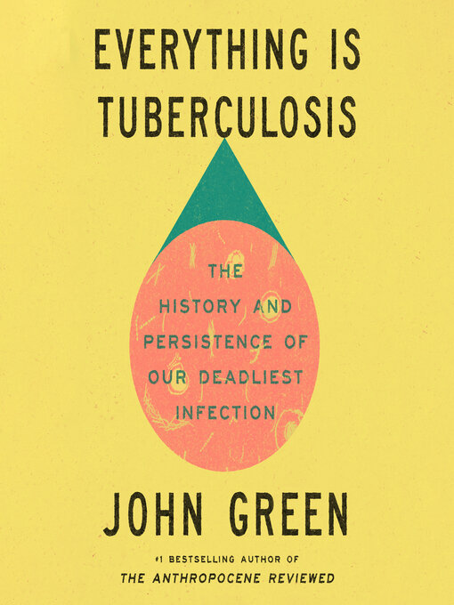{loading="lazy"}

::: {.fun-photo-caption}
**Everything Is Tuberculosis**

This was the book that made me realize I could enjoy non-fiction. And it's a quick read, too.
:::
:::

::: {.fun-photo}
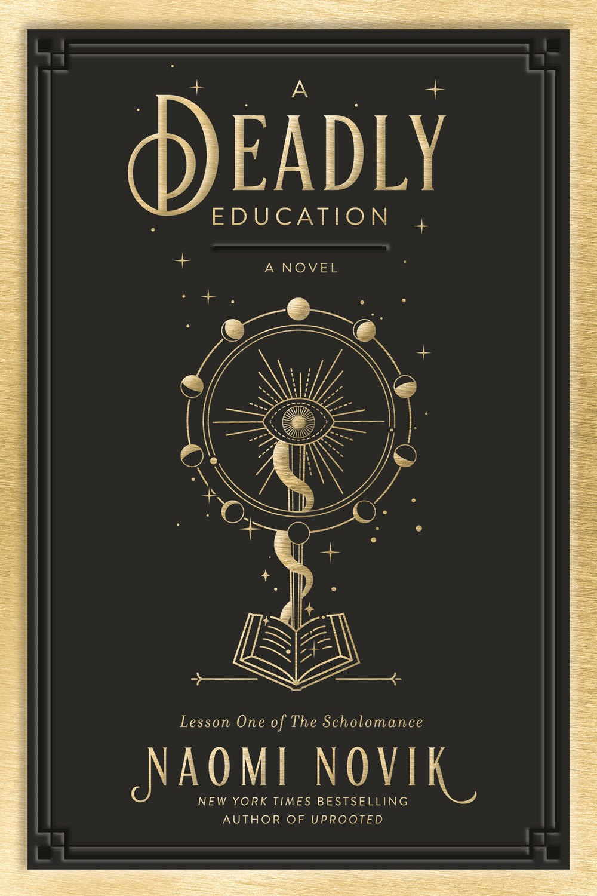{loading="lazy"}

::: {.fun-photo-caption}
**A Deadly Education**

Imagine if Harry Potter were better written, more interesting, and not written by a transphobe.
:::
:::

::: {.fun-photo}
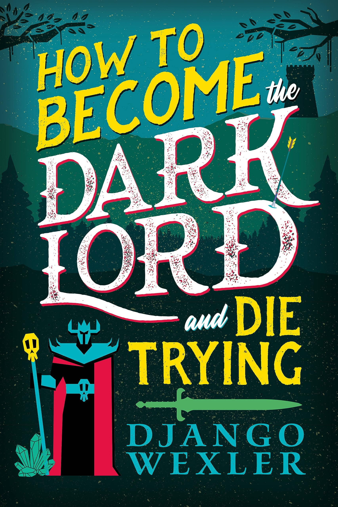{loading="lazy"}

::: {.fun-photo-caption}
**How to Become the Dark Lord and Die Trying**

The distribution of reviews for this book among my friends is bimodal. If you like the main character's voice, you'll love it, otherwise, give up. Personally, I loved it. 
:::
:::
:::
:::

::: {.fun-section}
::: {.fun-section-heading}
## Latte art

I have loved coffee and tea of all kinds for a very long time, from black light-roast filter coffee to sugary lattes to lightly sweetened Assam. In the last few months, I have been trying to improve my latte art in a small cortado cup (which I love, from [notNeutral](https://www.notneutral.com/collections/vero/products/vero-cortado-clear)).

:::

::: {.fun-gallery}
::: {.fun-photo}
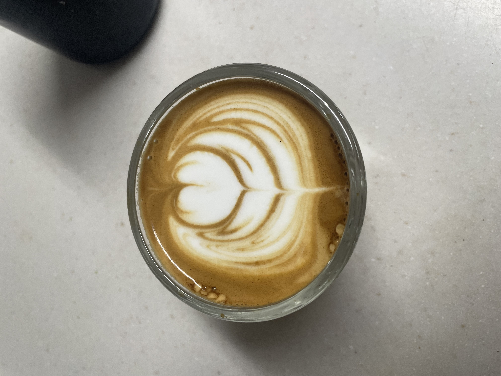{loading="lazy"}

::: {.fun-photo-caption}
**Tulip practice**

Trying to fill the cup with the design, which is harder than it sounds!
:::
:::

::: {.fun-photo}
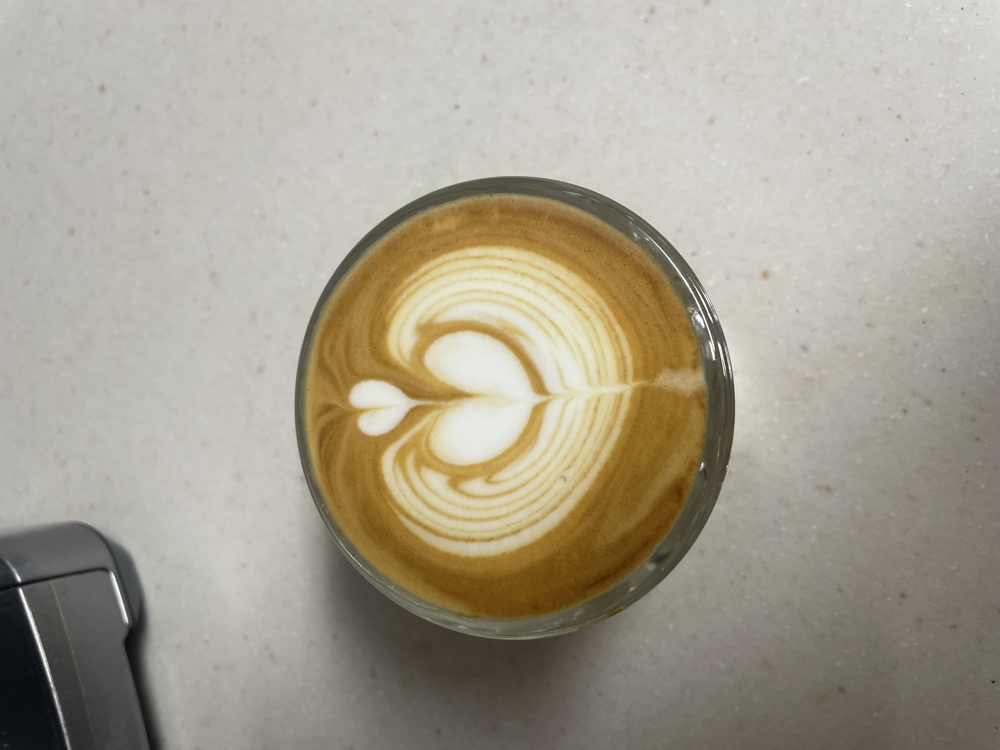{loading="lazy"}

::: {.fun-photo-caption}
**A heart on top**

Tulip on a cortado; first time I got the lines in the base to actually stand out. Pour speed is painfully important...
:::
:::
:::
:::

::: {.fun-section}
::: {.fun-section-heading}
## Things I'm listening to or watching

I've had to do quite a lot of driving in the last year, so I've jumped into the world of podcasts for the first time, but I've always enjoyed some good (and bad) television. Here are some things I've enjoyed recently:
:::

::: {.fun-gallery .fun-gallery-media}
::: {.fun-media-card .fun-media-featured}
::: {.fun-media-art}
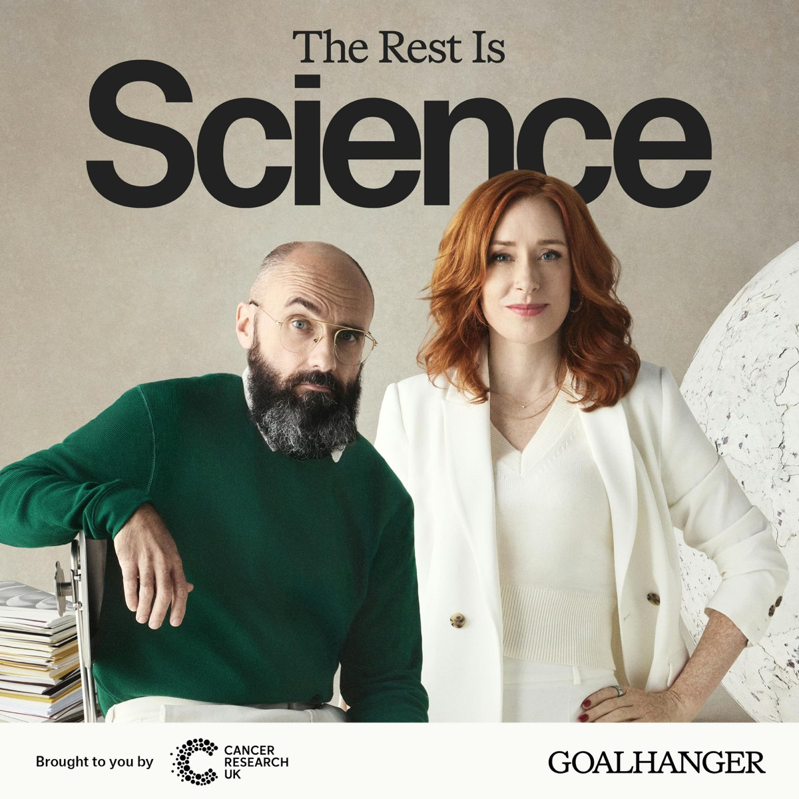{fig-alt="Artwork for The Rest Is Science podcast" loading="lazy"}
:::

::: {.fun-media-type}
Podcast
:::

### [The Rest Is Science](https://therestis.com/science)

Hannah Fry (math professor and TV presenter) and Michael Stevens (of Vsauce fame) take on big scientific questions with a combination of expertise, joyful curiosity, and many, many interesting tangents. I started listening to this because I loved the Vsauce channel when Michael was still posting on it, and this podcast has not disappointed. And now I'm a Hannah Fry fan, too.
:::

::: {.fun-media-card}
::: {.fun-media-art}
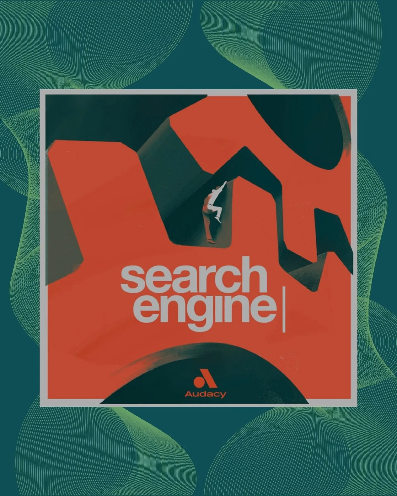{fig-alt="Artwork for the Search Engine podcast" loading="lazy"}
:::

::: {.fun-media-type}
Podcast
:::

### [Search Engine](https://www.searchengine.show/)

PJ Vogt takes the kinds of questions I might type into a search bar in the middle of the night and follows them much, much further than you expect. Not every episode is a hit, but the good ones are funny, odd, fascinating, and/or unexpectedly moving. I always come out of these having learned something I want to tell my friends.
:::

::: {.fun-media-card}
::: {.fun-media-art}
{fig-alt="Artwork for The Checkup with Doctor Mike podcast" loading="lazy"}
:::

::: {.fun-media-type}
Podcast
:::

### [The Checkup with Doctor Mike](https://podcasts.apple.com/us/podcast/the-checkup-with-doctor-mike/id1646695974)

There are some gems in here. I particularly enjoy the ones where I get to watch a trained doctor take down people spreading insane medical misinformation.
:::

::: {.fun-media-card}
::: {.fun-media-art}
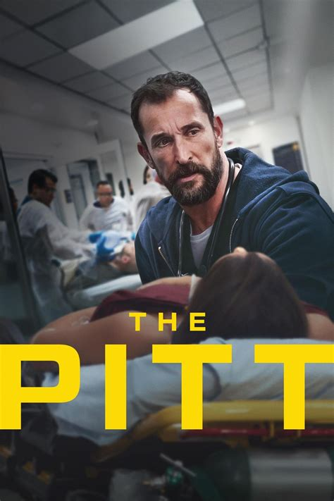{fig-alt="Artwork for The Pitt television series" loading="lazy"}
:::

::: {.fun-media-type}
TV
:::

### [The Pitt](https://tv.apple.com/us/show/the-pitt/umc.cmc.1pz1gv66445ky26uvtiqmrjup)

You might know it from the dozens and dozens of awards it has won since it came out in 2025. The level of realism in treatments made me want to start learning a lot more about anatomy and medicine in general.
:::

::: {.fun-media-card}
::: {.fun-media-art}
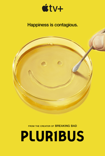{fig-alt="Artwork for the Pluribus television series" loading="lazy"}
:::

::: {.fun-media-type}
TV
:::

### [Pluribus](https://tv.apple.com/us/show/pluribus/umc.cmc.37axgovs2yozlyh3c2cmwzlza)

You might also know this one from the many awards its first season has won, though we won't get another one for way too long. I have heard it called "strange, funny, and unsettling" and I agree with that assessment. I will also watch and appreciate most things with a queer woman as a main character.
:::
:::
:::
